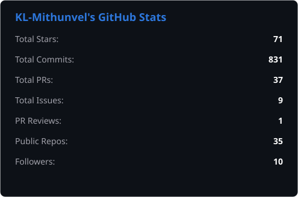
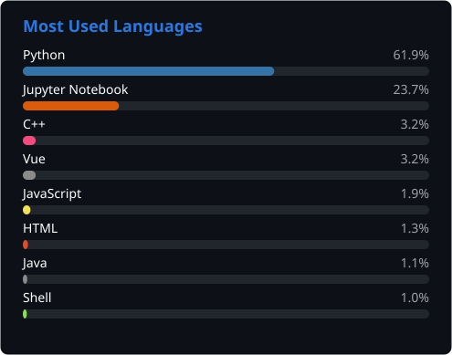

# Hello World! I'm **Mithunvel KL** 🤠
### Mechatronics & Automation Engineer | Embedded Systems | Robotics | Industrial & Process Engineering

- 🔭 Currently working on:
  - **HERC-26** — Autonomous rover for the Human Exploration Rover Challenge 2026
  - **Intel RealSense** camera integration
- 🌱 Currently learning: Red Hat Linux, ROS 2, advanced SLAM
- 📫 Reach me at:
  - klmithunvel@outlook.com
  - [LinkedIn](https://www.linkedin.com/in/mithunvel-k-l-1b5845287/)

> Most of my work is open source — feel free to use it and reach out if you need help 😃

---

## 🛠️ Tech Stack

**Languages:** Python • C++ • Verilog • Assembly • SQL • Bash • R • G-code

**Hardware:** Raspberry Pi • Arduino • ESP32 • Jetson Nano • FPGA (Xilinx Arty S7) 

**Software & Tools:** MATLAB • Git • Roboflow • KiCAD • SolidWorks • Onshape • Vivado • Webots • Jupyter Notebook • Docker • Flask • ROS 2 • OpenCV

---

## 🔧 What I Build

I work across the full hardware-software stack  from low-level digital logic and firmware to data pipelines and web dashboards. Here's a flavour of what I've worked on; you can find all of it in my repos.

**Autonomous Robotics**  
Competition-grade rover systems with multi-sensor fusion, dual-microcontroller architectures, real-time telemetry logging, and live web dashboards. Designed to run continuously and recover gracefully from hardware or network failures.

**FPGA & Digital Hardware**  
Implemented complex digital systems in Verilog on FPGA  including encryption logic, state machines, custom keyboard matrix interfaces, and LED output boards paired with PCB design and 3D-printed enclosures.

**IoT & Embedded Systems**  
End-to-end IoT devices that go from sensor to actuator: automated plant care systems, weather stations with real-time data acquisition, and sensor-driven control loops all built around clean abstraction layers and config-driven logic.

**Data Pipelines & Analysis**  
Weather and telemetry pipelines with dual-database logging (SQLite + TimescaleDB), REST APIs, CSV export, and statistical analysis in R and Python. Production deployments using systemd and Nginx.

**AI & Computer Vision**  
Applied machine learning to industrial problems including tile defect detection and grading using Roboflow and custom AI models. Also explored AI-driven traffic management and industrial system optimisation.

**Simulation & CAD**  
Physics-based simulations in MATLAB and Webots, robot kinematics (forward and inverse) modelled and visualised, and mechanical designs produced in SolidWorks and Onshape for fabrication and 3D printing.

**Tooling & CLI Libraries**  
Open-source Python utilities and reusable CLI frameworks published with MIT licences designed for real adoption across projects, not just personal use.

**CNC & Fabrication**  
G-code programs for CNC machining and 3D printing, covering the mechanical end of the automation stack.

---

## 📊 Stats

| GitHub Stats | Top Languages |
|-------------|--------------|
|  |  |

